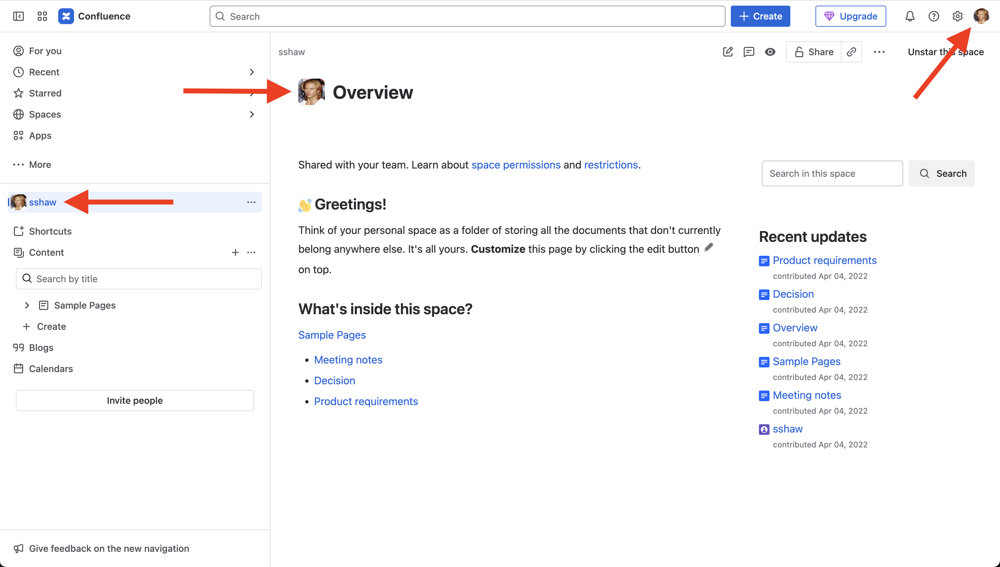

# Content Swapper

Sick of seeing certain usernames or profile photos? Content Swapper is a Chrome extension that can replace them
with more "user-friendly" alternatives.

## Examples

### GitHub Profile Page

#### Before

#### After

User profile and page text can all be changed. Here we chose to change everything but we could have just done the profile image
or left the username as it was.

---

### GitHub Commit History

#### Before

#### After

---

### Jira and Confluence

Works with any site but if your job uses Jira you may want to start swappin' there!

#### Before

#### After

## Installation

Not available in the app store --yet!

1. Clone the git repo
1. Load the extension in Chrome:
   1. Enter to `chrome://extensions/` into the browser's address bar
   1. Enable "Developer mode"
   1. Click "Load unpacked" and select the directory

1. Configure the extension:
   1. From Chrome's Extensions menu click "Content Swapper"
   2. Then Open Options
   3. Add a Site
   3. Enter options to replace images and text
   4. For GitHub sites `Profile ID` is the ID from the user's profile URL (should just fetch from GitHub username but that's for v2 I guess)

## The Code

At the initial commit 98% of the code and `manifest.json` was generated by
[Grok](https://grok.com/) over 10-20 prompts using the free plan.
The remaining was bug fixes, display copy and UI tweaks, and changing `manifest.json`'s `description`.

The README was a finely crafted human production.

At some point Waiting for Grok output was like waiting for your C or Java program to compile.

It also felt like the coding errors increased as the prompts increased and the requirements changed.
But most of these were refined in the follow-up prompts. Not sharing the Grok session 😉🤫

## License

Released under the MIT License: www.opensource.org/licenses/MIT

---

Made by [ScreenStaring](http://screenstaring.com?utm_source=content-swapper&utm_medium=docs&utm_campaign=github)
